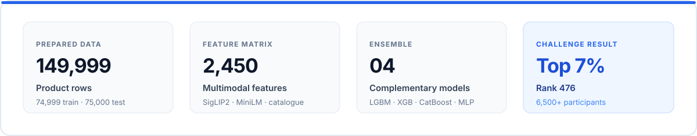
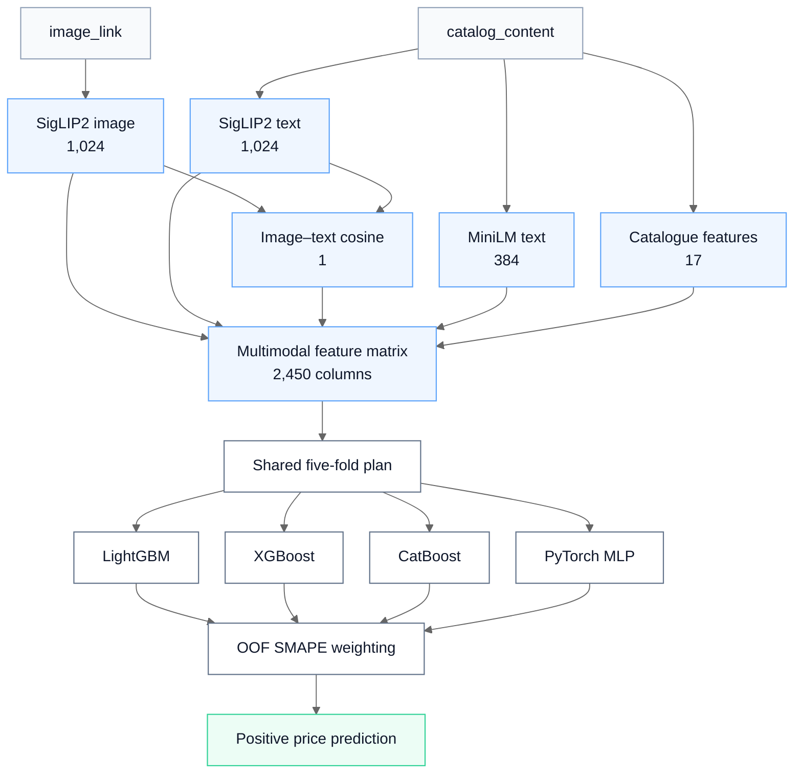

# Amazon ML Challenge 2025 — Multimodal Product Price Prediction

[](https://www.python.org/)
[](LICENSE)
[](#result)

**[Setup](docs/SETUP.md) · [Data and artifacts](docs/DATA.md) · [Kaggle notebooks](archive/kaggle/README.md)**

A multimodal price-prediction system built for the **Amazon ML Challenge 2025**, held from
**11–13 October 2025**. The final solution combines engineered catalogue signals, SigLIP2 and
MiniLM embeddings, and a learned ensemble of LightGBM, XGBoost, CatBoost, and PyTorch MLP models.



## Problem

The task was to predict a positive price for each product from three fields:

- `catalog_content`: title, description, bullet points, brand, quantity, and unit information;
- `image_link`: the product image;
- `sample_id`: the identifier used to align each prediction with the test set.

The prepared data contains **74,999 training rows** and **75,000 test rows**. Submissions are
evaluated with symmetric mean absolute percentage error (SMAPE).

## Solution

The feature pipeline captures product identity, visual appearance, semantic context, quantity,
pack size, and the agreement between the image and listing text.

| Feature block | Width | Signal |
|---|---:|---|
| SigLIP2 image projection | 1,024 | Product type, packaging, form, and visual context |
| SigLIP2 text projection | 1,024 | Catalogue semantics in the same image–text space |
| Image–text cosine similarity | 1 | Cross-modal agreement |
| MiniLM text embedding | 384 | Compact sentence-level catalogue semantics |
| Engineered catalogue features | 17 | Quantity, units, brand, product class, and text structure |
| **Combined matrix** | **2,450** | Complete multimodal representation |

The implementation preserves row order through every stage. Each feature block carries an ordered
`sample_id` file and a manifest containing its shape, dtype, configuration hash, and source hashes.
The assembler rejects missing, duplicated, reordered, non-finite, or dimensionally inconsistent
inputs before training begins.

## Architecture



### Catalogue features

The fixed 17-column catalogue block contains parsed quantities and units, declared value, text
lengths, bullet and measurement counts, presence indicators, and training-set frequency signals
for unit, brand, and product class. Unseen test categories map to zero, so the feature width and
semantics remain stable.

### Four-model ensemble

All models train on `log1p(price)` with the same shuffled five-fold assignment. Their out-of-fold
predictions are combined by directly minimizing SMAPE under non-negative, sum-to-one weight
constraints. Each model retains at least one percent of the final blend. The four learners are then
refit on the complete training matrix and used to predict the test set.

| Model | Contribution |
|---|---|
| LightGBM | Leaf-wise gradient boosting over the dense multimodal matrix |
| XGBoost | Regularized histogram-based boosted trees |
| CatBoost | Symmetric boosted trees with strong nonlinear interactions |
| PyTorch MLP | Fold-normalized dense representation learning |

Predictions are transformed back with `expm1`, clipped to a minimum of `0.01`, checked for finite
values, and aligned to the original test `sample_id` order.

## Result

**Rank 476 of 6,500+ participants — Top 7% in the Amazon ML Challenge 2025.**

## Repository map

```text
.
├── configs/final.json        # Canonical feature, model, fold, and blend contract
├── src/amazon_ml_price/      # Data, features, ensemble, and command-line workflow
├── data/samples/             # Fictional records matching the challenge schema
├── archive/                  # Kaggle notebooks, metadata, and artifact manifest
├── docs/                     # Setup and data guidance
├── scripts/                  # Bounded Kaggle asset downloader
└── tests/                    # Contract and pipeline checks
```

See **[Setup](docs/SETUP.md)** for the commands and **[Data and artifacts](docs/DATA.md)** for the
local directory contract.

## Technical references

| Component | Reference |
|---|---|
| SigLIP2 | Tschannen et al., *[SigLIP 2](https://arxiv.org/abs/2502.14786)* · [`google/siglip2-large-patch16-384`](https://huggingface.co/google/siglip2-large-patch16-384) · [Transformers documentation](https://huggingface.co/docs/transformers/model_doc/siglip2) |
| MiniLM sentence embeddings | Reimers and Gurevych, *[Sentence-BERT](https://arxiv.org/abs/1908.10084)* · Wang et al., *[MiniLM](https://arxiv.org/abs/2002.10957)* · [`sentence-transformers/all-MiniLM-L6-v2`](https://huggingface.co/sentence-transformers/all-MiniLM-L6-v2) |
| LightGBM | Ke et al., *[LightGBM](https://papers.nips.cc/paper/6907-lightgbm-a-highly-efficient-gradient-boosting-decision-tree)* · [official documentation](https://lightgbm.readthedocs.io/) |
| XGBoost | Chen and Guestrin, *[XGBoost](https://arxiv.org/abs/1603.02754)* · [official documentation](https://xgboost.readthedocs.io/) |
| CatBoost | Prokhorenkova et al., *[CatBoost](https://proceedings.neurips.cc/paper/2018/hash/14491b756b3a51daac41c24863285549-Abstract.html)* · [official documentation](https://catboost.ai/docs/) |
| PyTorch | Paszke et al., *[PyTorch](https://arxiv.org/abs/1912.01703)* · [official documentation](https://docs.pytorch.org/docs/stable/) |

## Team

- Sourabh Kapure
- [Harshit Ranjan](https://github.com/HarshitR2004)

## License

Released under the [MIT License](LICENSE).
